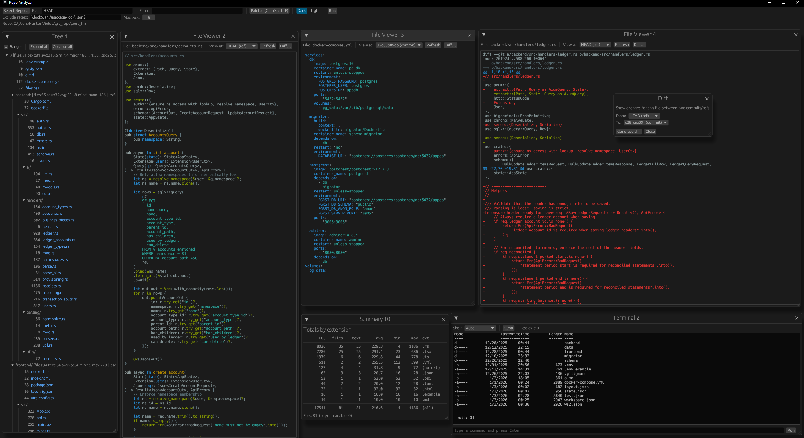

# Was migrating this powershell script to python

```
param(
  [string]$Ref = "origin/dev",
  # Exclude any *.lock AND any package-lock.json anywhere in the repo
  [string[]]$ExcludeRegex = @(
    '\.lock$',
    '(^|/)package-lock\.json$'
  )
)

function Should-Exclude([string]$path) {
  foreach ($rx in $ExcludeRegex) {
    if ($path -match $rx) { return $true }
  }
  return $false
}

$files = git ls-tree -r --name-only $Ref | Where-Object { -not (Should-Exclude $_) }

$rows = foreach ($f in $files) {
  $content = git show "$Ref`:$f" 2>$null
  if ($LASTEXITCODE -ne 0) { continue } # skip binary/unreadable blobs

  $lines = ($content | Measure-Object -Line).Lines
  $ext = ([IO.Path]::GetExtension($f)).ToLower()

  [pscustomobject]@{
    File  = $f
    Ext   = $ext
    Lines = $lines
  }
}

"--- LOC by file (A→Z) ---"
$rows | Sort-Object File | Format-Table Lines, File -AutoSize

"`n--- Total LOC by file extension ---"
$rows |
  Group-Object Ext |
  ForEach-Object {
    $extName = $_.Name
    if ([string]::IsNullOrEmpty($extName)) { $extName = "(no ext)" }

    [pscustomobject]@{
      Ext   = $extName
      Lines = ($_.Group | Measure-Object Lines -Sum).Sum
    }
  } |
  Sort-Object Lines -Descending |
  Format-Table Lines, Ext -AutoSize

"`n--- Total LOC overall ---"
($rows | Measure-Object Lines -Sum).Sum

```

# 4 hours later I ended up with this:



## Many exciting updates to come 