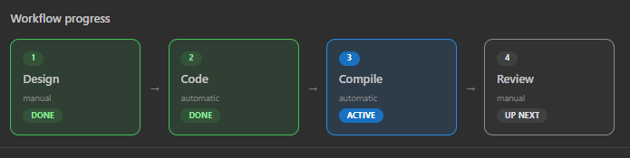
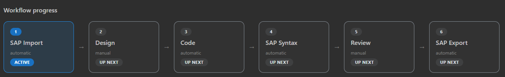
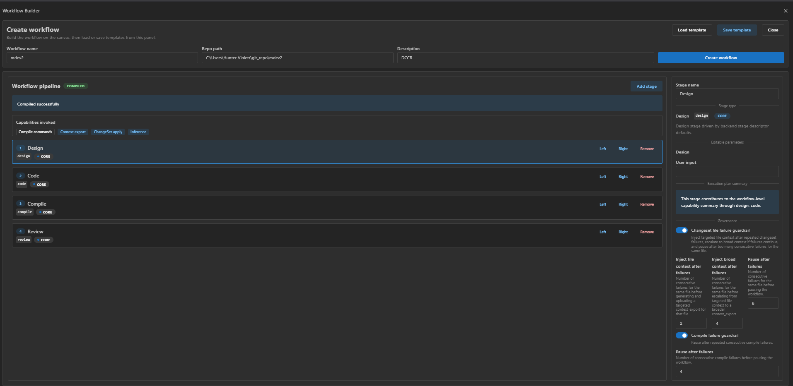
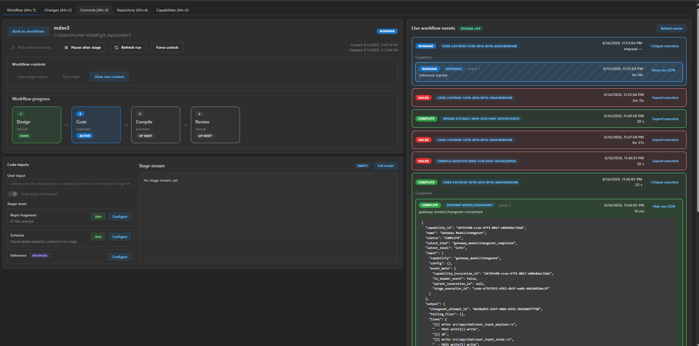

A headless workflow orchestration platform with modular, composable workflow stages, deterministic execution paths, and pluggable integration layers, including multi-model orchestration, Git, and SAP. Created a centralized execution harness where model sessions are routed through controlled, auditable workflow stages with bounded inputs, structured outputs, and recovery points, enabling predictable, measurable, and governed automation of enterprise software delivery from planning to deployment.

Documentation coming eventually

### MDEV 1.1.0 (Web)

#### Workflow examples

#### Workflow builder 

#### Workflow control 

### MDEV 1.0.2 (Desktop)

