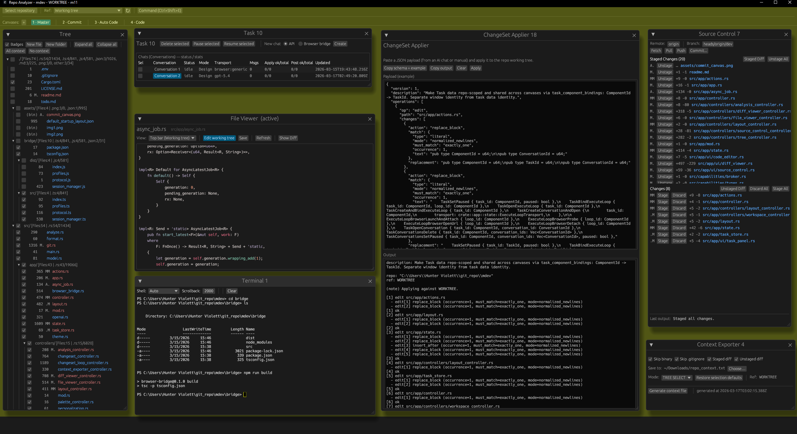
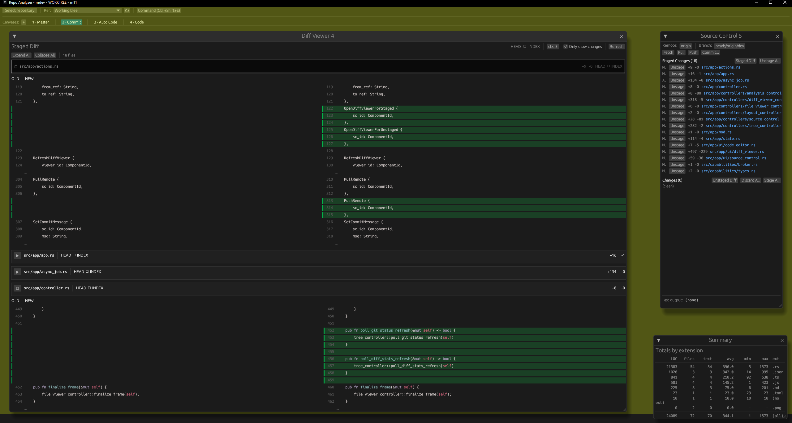

### AI SWE IDE

An agile software engineering workflow application to progressively automate complex system development through increasing levels of orchestration and reduced manual intervention.

Documentation coming soon 

